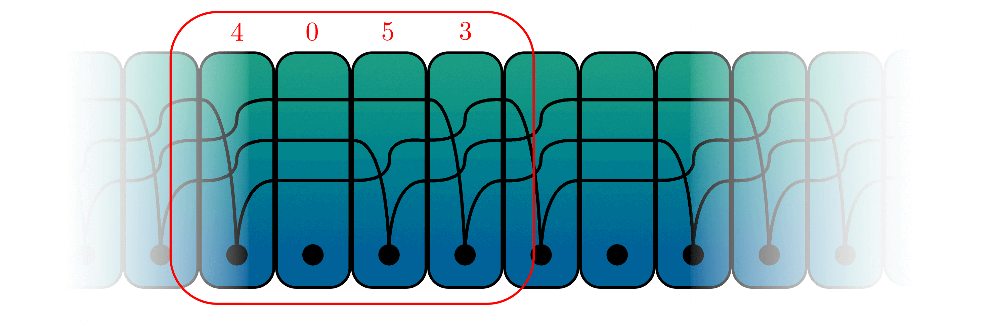
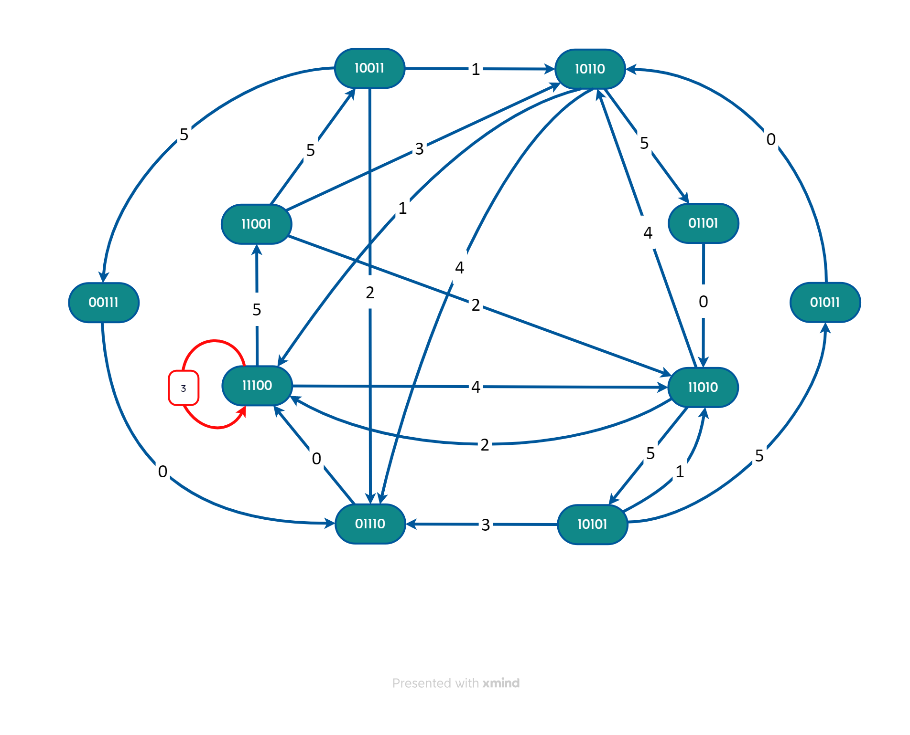
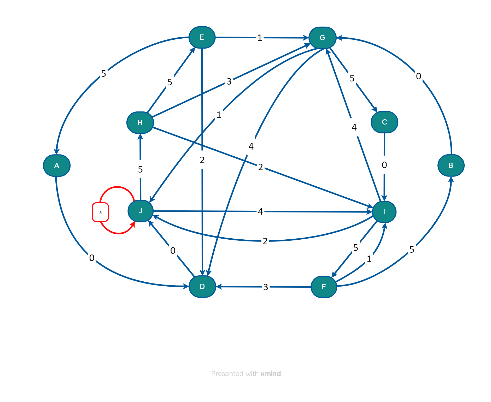
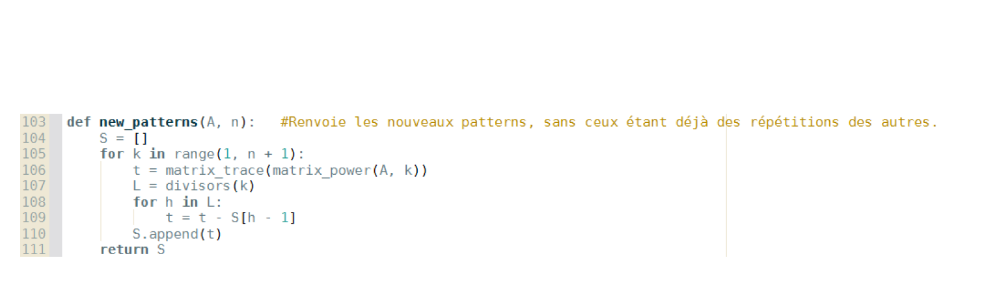
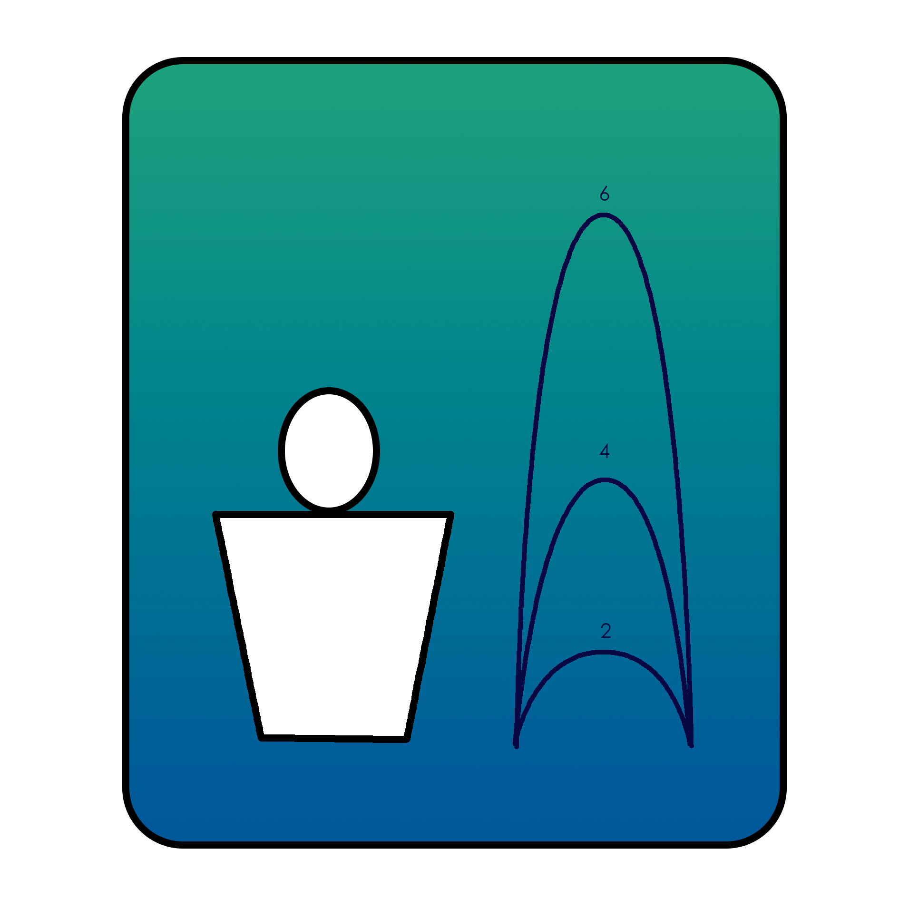
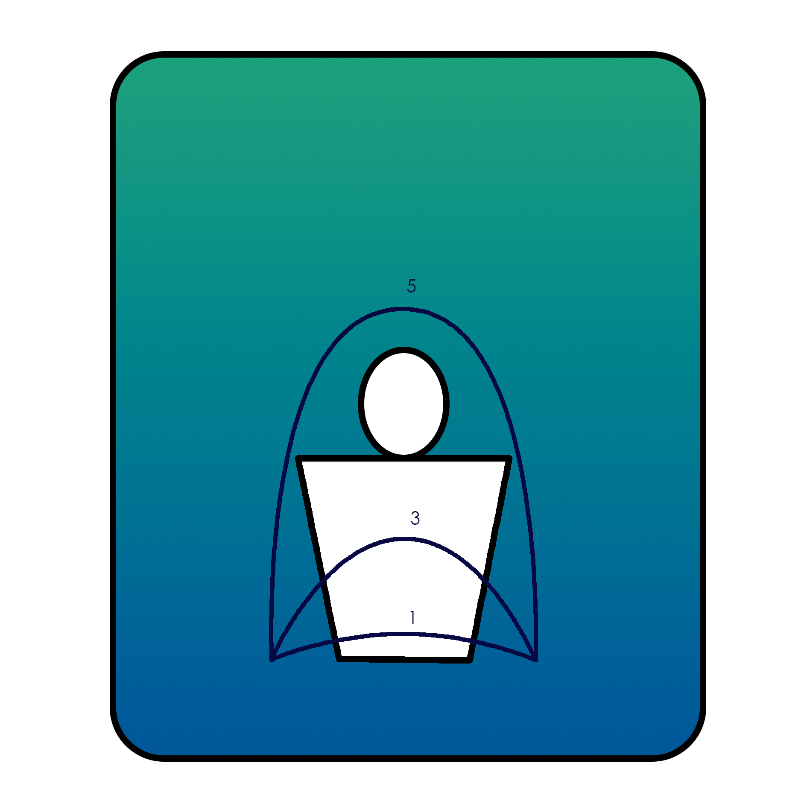

# Juggling Sequence Enumeration

How many distinct juggling sequences exist? A graph-theoretic answer — built from scratch in Python.

This was my TIPE project (Travaux d'Initiative Personnelle Encadrés) in Classe Préparatoire MP, 2023–2024.

- **Slides** (French): [`docs/slides.pdf`](./docs/slides.pdf)
- **MCOT** (official submission): [`docs/mcot.pdf`](./docs/mcot.pdf)

---

## The problem

Juggling has been studied mathematically since the 1980s. The question driving this project was deceptively simple: **given b balls, a maximum throw height H and a sequence period t, how many valid juggling sequences exist?**

The standard encoding is **siteswap notation** — each integer in the sequence represents how many time steps a ball stays in the air. The **average theorem** guarantees validity: a sequence is jugglable if and only if its average equals the number of balls.


*Siteswap sequence 4053 — visualised with juggling cards*

---

## Approach — graph theory

The key insight: represent the juggler's state at any moment as a binary vector of length H with exactly b ones, where position i indicates whether a ball lands in i steps.

Each valid throw transitions the juggler from one state to the next, defining a **directed juggling graph** where nodes are states and edges are valid throws. A juggling sequence of period t corresponds exactly to a **closed path of length t** in this graph.

| b=3, H=5 juggling graph | Second graph example |
|:---:|:---:|
|  |  |

The self-loop on state `11100` with throw 3 corresponds to the sequence `"3"` — the standard 3-ball cascade.

---

## Counting formula

Counting closed paths via the adjacency matrix $M$:

$$\gamma(t) = \operatorname{tr}(M^t) - \sum_{\substack{d \mid t \\ d < t}} \gamma(d)$$

$$\text{Patterns}(t) = \frac{\gamma(t)}{t}$$

$\gamma(t)$ isolates sequences whose minimal period is exactly $t$ by subtracting all closed paths that are repetitions of shorter ones (Möbius inversion on the divisor lattice). Dividing by $t$ removes rotational equivalents.

---

## Result

Running `all_patterns_count()` across all ball counts up to **b = 10**, maximum height **H = 10**, and periods up to **t = 10**:

**1,342,382 distinct juggling sequences.**



---

## Usage

```bash
pip install numpy
python programme_tipe.py
```

### Key functions

```python
# Count all distinct sequences up to b=10, H=10, t=10
all_patterns_count()  # → 1,342,382

# Count new sequences of period t for given b and H
new_patterns(adj_matrix, max_period)

# Generate a random valid sequence
random_pattern(num_balls=3, max_height=5, period=4)
# e.g. → '5314'

# Build the adjacency matrix of the juggling graph
adjacency_matrix(num_balls, max_height)
```

---

## Project structure

```
juggling-sequence-enumeration/
├── programme_tipe.py   # Full Python implementation
├── docs/
│   ├── slides.pdf      # Oral presentation slides
│   └── mcot.pdf        # Official MCOT submission
└── images/
    ├── sequence.png     # Siteswap sequence (juggling cards)
    ├── map1.png         # Juggling graph — b=3, H=5
    ├── map2.png         # Juggling graph — second example
    ├── new_patterns.png # Results — new patterns per period
    ├── C0–C3.png        # Individual juggling cards
    ├── lancers_pairs.png    # Even throws illustration
    └── lancers_impairs.png  # Odd throws illustration
```

---

## Background

Siteswap notation was independently developed by several jugglers and mathematicians in the 1980s. The mathematical framework used here — state graphs and closed-path counting — follows the approach of Buhler, Eisenbud, Graham & Wright (1994).

 

*Even throws (direct) and odd throws (crossing hands)*
